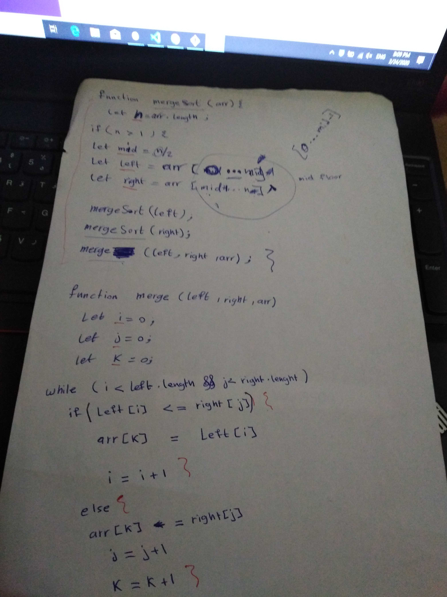

Trace
Sample Array: [8,4,23,42,16,15]

Pass 1:

Pass 1 of mergrSort

In the first pass through of the merggeSort, we check if the array is have more than one element, then we assign n to arr.length, mid to n/2 then we slice the array into two pieces left and right.
mid : 3
left [ 8, 4, 23 ]
right [ 42, 16, 15 ] 

Pass 2:

Pass 2 of mergrSort

The second pass through the left array then it will do the same slice the array into two pieces left and right.
mid : 1
left [ 8 ]
right [ 4, 23 ]

Pass 3:

Pass 3 of mergrSort

mid : 1
left [ 4 ]
right [ 23 ]
Pass 4:

Pass 4 of mergrSort

mid : 1
left [ 42 ]
right [ 16, 15 ]

Pass 5:

Pass 5 of mergrSort

mid : 1
left [ 16 ]
right [ 15 ]

Pass 6:

Pass 6 of mergrSort

On its final iteratation through the array, retur to merge function and passes left and right.
[ 4, 8, 15, 16, 23, 42 ]

Efficency
Time: O(n^2)
The basic operation of this algorithm is comparison. This will happen n * (n-1) number of times…concluding the algorithm to be n squared.
Space: O(1)
No additional space is being created. This array is being sorted in place…keeping the space at constant O(1

