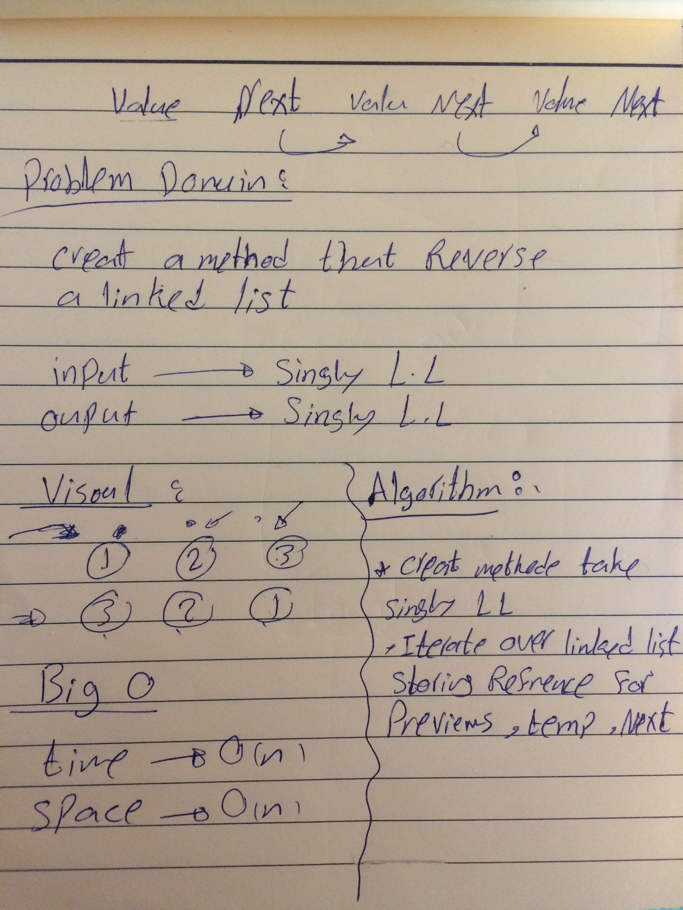

# 401-data-structures-and-algorithms

# Challenge Summary

write a function to reverse a Singly Linked List.
## Challenge Description

Iterating over the linked list and storing a reference to a current node, its previous node, and its next node.
In every iteration, after the next node is stored, the current’s node next pointer is pointed at the stored reference to the previous node.

## Approach & Efficiency
it taked 2 hours 

## Solution

