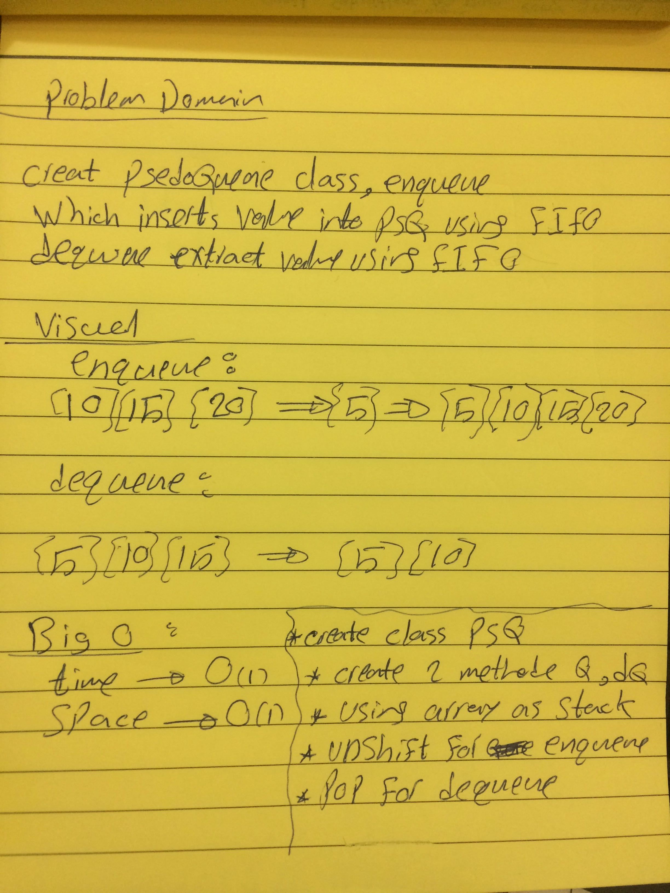

# 401-data-structures-and-algorithms

# Challenge Summary

Create a brand new PseudoQueue class. methods : enqueue , dequeue

## Challenge Description

Create a brand new PseudoQueue class.  PseudoQueue class will implement our standard queue interface (the two methods listed below), but will internally only utilize 2 Stack objects. Ensure that you create your class with the following methods:
enqueue which inserts value into the PseudoQueue, using a first-in, first-out approach.
dequeue which extracts a value from the PseudoQueue, using a first-in, first-out approach.

## Approach & Efficiency
it taked 2 hours 

## Solution

