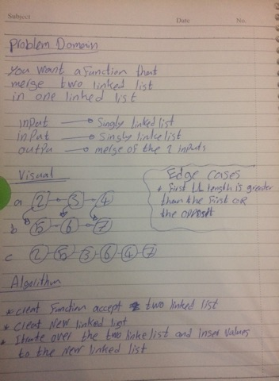

# 401-data-structures-and-algorithms

# Challenge Summary

Write a function called mergeLists which takes two linked lists as arguments.

## Challenge Description

Zip the two linked lists together into one so that the nodes alternate between the two lists and return a reference to the head of the zipped list. Try and keep additional space down to O(1).

## Approach & Efficiency
it taked 2 hours 

## Solution

