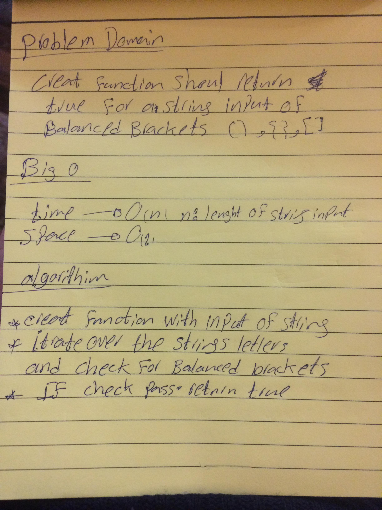

# 401-data-structures-and-algorithms

# Challenge Summary

 function should take a string as its only argument, and should return a boolean representing whether or not the brackets in the string are balanced. 

## Challenge Description

here are 3 types of brackets:

Round Brackets : () ==> true
Square Brackets : [] ==> true
Curly Brackets : {} ==> true

## Approach & Efficiency
it taked 2 hours 

## Solution

