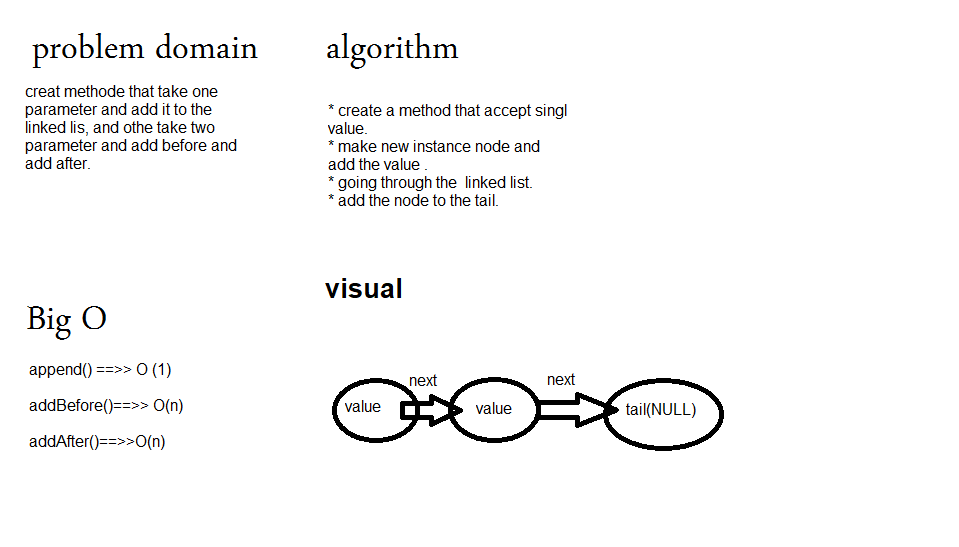

# Challenge Summary

## ll-insertions

Write methods for the Linked List class.

## Challenge Description

* create .append(value) method, which adds a new node with the given value to the end of the list.
* create .insertBefore(value, newVal) methods, which add a new node with the given newValue immediately before the first    value node.

* create.insertAfter(value, newVal) method, which add a new node with the given newValue immediately after the first        value node

## Approach & Efficiency

1 hour.

## Solution

