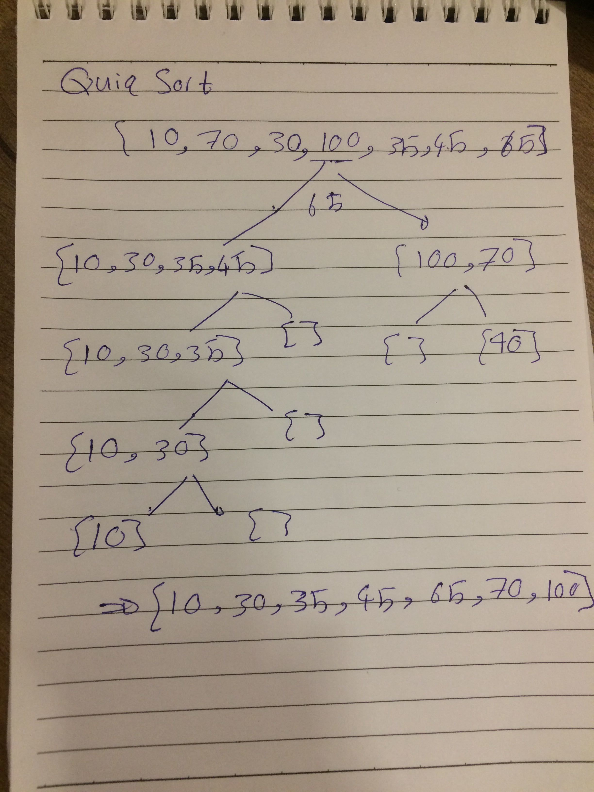

# 401-data-structures-and-algorithms

# Challenge Summary
Provide a visual step through for each of the sample arrays based on the provided pseudo code
Convert the pseudo-code into working code in your language
Present a complete set of working tests

* Big O:

time o(n^2)
space o(1)
## Approach & Efficiency
it taked 2 hours 

## Solution

