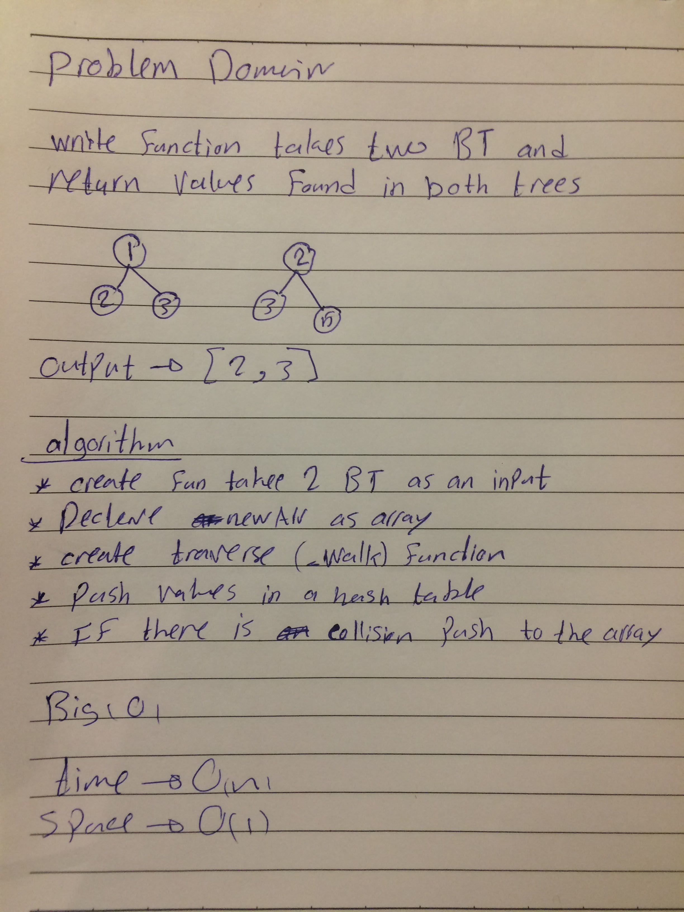

# 401-data-structures-and-algorithms

# Challenge Summary

Write a function called tree_intersection that takes two binary tree parameters.
Without utilizing any of the built-in library methods available to your language, return a set of values found in both trees.

## Approach & Efficiency
it taked 2 hours 

## Solution

